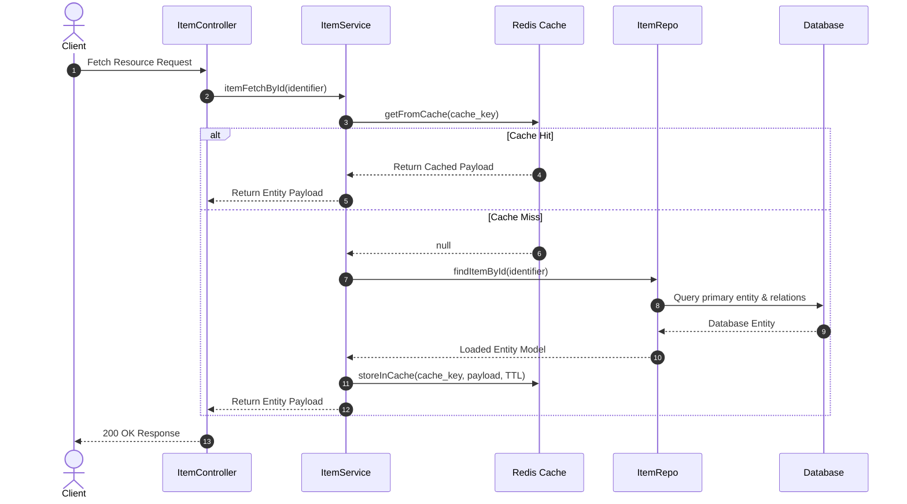
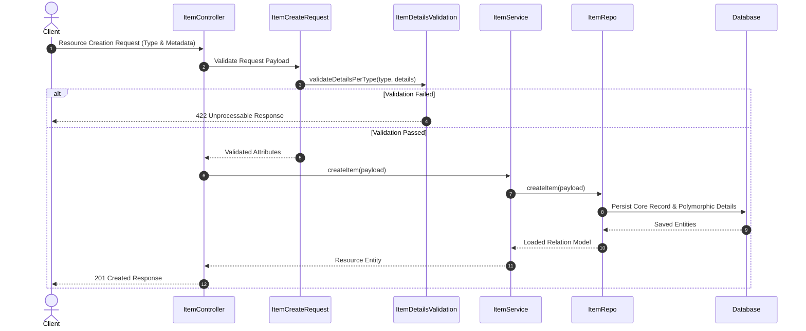

# Universal Reservation & Resource Inventory API

[](https://php.net)
[](https://laravel.com)
[](https://laravel.com/docs/sanctum)
[](https://redis.io)
[](https://pestphp.com)
[](LICENSE)

An enterprise-grade, high-performance backend architecture built with **Laravel 12**, **PHP 8.2+**, and **Redis** for universal resource reservation, multi-category inventory tracking, and dynamic asset management. Designed using the **Repository-Service Pattern**, it features polymorphic JSON schema validation across 12 resource categories, multi-key Redis cache invalidation strategies, stateful concurrency controls, and token-based security.

---

## 📋 Short GitHub Repository Description

> *High-performance Laravel 12 & Redis backend architecture for universal resource reservation and inventory management featuring multi-category polymorphic JSON validation, Repository-Service architecture, multi-key caching strategies, and token authentication.*

---

## 🏛 Architecture & Engineering Patterns

The system adheres to modern backend architectural patterns, emphasizing strict separation of concerns, maintainability, and high-throughput read operations.

```
       ┌─────────────────────────────────────────────────────────────┐
       │                       Incoming Request                      │
       └──────────────────────────────┬──────────────────────────────┘
                                      │
                                      ▼
       ┌─────────────────────────────────────────────────────────────┐
       │                   Form Request Validation                   │
       │     (ApiValidationResponse & ItemDetailsValidation Traits)   │
       └──────────────────────────────┬──────────────────────────────┘
                                      │
                                      ▼
       ┌─────────────────────────────────────────────────────────────┐
       │                     Controller Layer                        │
       │             (ItemController / AuthController)               │
       └──────────────────────────────┬──────────────────────────────┘
                                      │
                                      ▼
       ┌─────────────────────────────────────────────────────────────┐
       │                      Service Layer                          │
       │               (ItemService / AuthService)                   │
       └──────────────┬──────────────────────────────┬───────────────┘
                      │                              │
           Cache Check│ (Read-through)     DB Access │ (Write/Invalidate)
                      ▼                              ▼
       ┌──────────────────────────────┐┌──────────────────────────────┐
       │        Redis Cache           ││      Repository Layer        │
       │       (CacheService)         ││     (ItemRepo / UserRepo)    │
       └──────────────────────────────┘└──────────────┬───────────────┘
                                                     │
                                                     ▼
                                       ┌──────────────────────────────┐
                                       │     Database (Eloquent ORM)  │
                                       └──────────────────────────────┘
```

### 1. Repository-Service Pattern
- **Controllers**: Handle request transport, request mapping, and standardized JSON responses.
- **Service Layer (`app/Http/Services`)**: Encapsulates business logic, cache invalidation workflows, domain operations, and authentication orchestration.
- **Repository Layer (`app/Http/Repositories`)**: Abstracts database queries, model relationships, and transactional database updates.

### 2. Polymorphic Dynamic Validation Engine
The platform supports multi-domain resource management (hardware, spaces, events, digital assets, etc.). Custom `FormRequest` validation traits (`ItemDetailsValidation` and `ApiValidationResponse`) enforce type-specific validation rules dynamically based on the requested resource `type`:

| Resource Type | Domain Focus & Attributes |
| :--- | :--- |
| **`physical`** | Weight, 3D Dimensions (length, width, height), Material, Manufacturer, Serial Number, Warranty, Storage Location |
| **`consumable`** | Stock On Hand, Measurement Unit, Expiry Date, Reorder Point, Supplier ID, Lot Number, Usage Rate |
| **`spaces`** | Capacity, Area/Dimensions, Location, Amenities array, Availability Windows, Hourly Rate |
| **`equipment`** | Manufacturer, Model, Serial Number, Purchase Date, Maintenance Schedule, Manual URL, Status |
| **`vehicle`** | VIN, License Plate, Make/Model, Year, Mileage, Registration Expiry, Fuel Type |
| **`appointment`** | Start/End Timestamps, Participant IDs, Location, Purpose, Organizer ID, Reminders |
| **`event`** | Start/End Timestamps, Venue, Capacity, Organizer, Ticketing Config, Public Visibility |
| **`session`** | Recurrence Rules, Instructor ID, Max Participants, Material Checklist |
| **`rental`** | Rental Rates, Rate Units (hourly/daily), Deposit Requirements, Availability Calendar |
| **`digital`** | Download URL, License Terms, File Type/Size, Access Expiry, Checksum |
| **`personnel`** | User ID, Role, Email/Phone Contact, Certifications, Shift Schedules |
| **`ad-hoc`** | Dynamic Custom Key-Value Fields, Operational Notes, Metadata Dictionary |

### 3. Multi-Key Redis Caching Strategy
To minimize database latency, `ItemService` integrates with `CacheService` backed by Redis:
- **Cache-Aside Read Strategy**: Queries check in-memory cache first before hitting database storage.
- **Multi-Key Indexing**: Items are cached individually under unique primary and secondary keys, as well as in composite collections.
- **Automated Cache Invalidation**: On entity deletion or updates, corresponding lookup keys are pruned automatically to prevent stale state propagation.
- **Cache Inspection Suite**: Provides real-time TTL and key serialization analysis via `CacheInspectorService`.

### 4. Concurrency & Transactional Inventory Architecture
The transactional subsystem incorporates optimistic concurrency controls and auditability:
- **Inventory Balances**: Maintains concurrency version tracking alongside total and available stock levels.
- **Reservations Lifecycle**: Stateful reservation processing (`active`, `expired`, `committed`, `released`) linked to operational references.
- **Transaction Logs**: Immutable ledger tracking every inventory allocation, commitment, and release.

---

## 🔄 System Data Flows

### Read-Through Caching Flow



### Item Creation & Polymorphic Validation Flow



---

## 🔒 Security & Data Protection Architecture

- **Token-Based Authentication**: Endpoint access control managed via **Laravel Sanctum**. API tokens are generated upon authentication and invalidated on session termination.
- **Credential Protection**: Passwords are securely hashed using native PHP cryptographic hashing algorithms (Argon2id/Bcrypt).
- **Injection Mitigation**: Database operations strictly utilize Eloquent ORM and Query Builder parameter binding to protect against SQL injection vulnerabilities.
- **Uniform Error Handling**: Implements custom exception handling in Form Requests (`ApiValidationResponse`), suppressing internal server stack traces to protect infrastructure topologies.
- **Runtime Environment Isolation**: Sensitive system configurations, secrets, and database credentials are decoupled from source control and managed strictly via runtime environments.

---

## 🗄 High-Level Domain Model & Schema Architecture

The database architecture is structured into decoupled domain areas to support high concurrency and data integrity:

```
+-----------------------------------------------------------------------+
|                         IDENTITY & ACCESS                             |
|  - User Credentials & Profile Metadata                                |
|  - Authentication Tokens & Access Permissions                         |
+-----------------------------------┬-----------------------------------+
                                    |
                                    | 1:N Owner / Creator
                                    v
+-----------------------------------------------------------------------+
|                       CORE RESOURCE DOMAIN                            |
|  - Unique System Identifiers (ID / SKU)                               |
|  - Resource Naming & Operational Status (Active/Inactive)             |
+-------------------┬───────────────────────────────┬-------------------+
                    |                               |
           1:1      |                               | 1:N
   Polymorphic Details|                               | Stock Mapping
                    v                               v
+-----------------------+               +-------------------------------+
|  EXTENDED ATTRIBUTES  |               |       INVENTORY BALANCES      |
| - Domain Category     |               | - Stock Quantities (Total/Avail)|
| - Custom JSON Payload |               | - Location Identifiers        |
| - Description Notes   |               | - Concurrency Version Control |
+-----------------------+               +---------------+---------------+
                                                        |
                                                +-------+-------+
                                            1:N |               | 1:N
                                                v               v
                                    +-------------------+ +-------------+
                                    |   RESERVATIONS    | | TRANSACTIONS|
                                    | - Status Lifecycle| | - Event Log |
                                    | - Expiry Windows  | | - Reference |
                                    | - Reference Link  | |   UUID      |
                                    +-------------------+ +-------------+
```

### Domain Subsystems
1. **Core Resource Domain**: Manages primary asset entities, unique identifiers, and operational availability status.
2. **Polymorphic Metadata Engine**: Extends core entities with domain-specific JSON details validated dynamically per category.
3. **Inventory & Stock Management**: Tracks total and available physical stock with version control mechanisms for concurrency safety.
4. **Reservation Lifecycle Engine**: Handles temporary locks, status progressions (`active`, `expired`, `committed`, `released`), and fulfillment references.
5. **Transactional Audit Ledger**: Records an immutable trail of system inventory movements and state transitions.

---

## 🚀 Installation & Setup Overview

### Prerequisites
- **PHP** >= 8.2 (with required database and cache extensions)
- **Composer** 2.x
- **Database Engine** (PostgreSQL / MySQL / SQLite)
- **Cache Engine** (Redis)

### Basic Setup Steps

1. **Clone Repository**
   ```bash
   git clone https://github.com/SioPauwiii/reservationAPI.git
   cd reservationAPI
   ```

2. **Install Dependencies**
   ```bash
   composer install
   ```

3. **Configure Environment & Key**
   Set up your system environment configuration and generate the application security key:
   ```bash
   php artisan key:generate
   ```

4. **Run Database Migrations**
   ```bash
   php artisan migrate
   ```

5. **Start Application**
   Run the local development server:
   ```bash
   php artisan serve
   ```
   Or launch via concurrent script:
   ```bash
   composer run dev
   ```

---

## 🧪 Testing & Quality Assurance

The codebase includes automated test suites built with **Pest PHP**:

```bash
# Run automated test suite
php artisan test

# Run test runner directly
./vendor/bin/pest
```

### Core Test Coverage
- ✅ Payload validation across all 12 polymorphic resource types.
- ✅ Database persistence and relational model integrity.
- ✅ Multi-attribute entity retrieval and search mechanisms.
- ✅ Standardized error handling and missing resource response codes.

---

## 📄 License

This project is open-sourced under the [MIT License](LICENSE).
